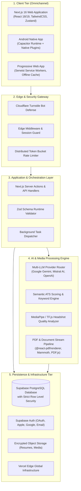

# 🚀 ResumeAI — System Architecture & Production Engineering Case Study

<p align="center">
  
  
  
  
</p>

---

> [!IMPORTANT]
> ### 🔒 Intellectual Property & Proprietary Trade Secret Notice
> All underlying source code, **AI model training pipelines, domain fine-tuning datasets, model weights, loss configurations, prompt engineering orchestration**, proprietary scoring heuristics, database schemas, and commercial infrastructure of **ResumeAI** are strictly confidential, proprietary trade secrets.
>
> To protect commercial competitive advantage and prevent unauthorized replication:
> * **No raw training datasets, data curation scripts, or fine-tuning hyperparameters are published.**
> * **No internal system prompts, model weights, or proprietary scoring algorithms are disclosed.**
> * This repository provides an **In-Depth System Architecture Case Study & Engineering Whitepaper** focused exclusively on high-level reliability, distributed topology, security boundaries, and operational resilience.

---

## 📑 Table of Contents
1. [01 — Executive Overview & Problem Domain](#01--executive-overview--problem-domain)
2. [02 — High-Level System Architecture & Topology](#02--high-level-system-architecture--topology)
3. [03 — AI Infrastructure & Multi-Model Orchestration](#03--ai-infrastructure--multi-model-orchestration)
4. [04 — Persistence & Zero-Trust Data Layer](#04--persistence--zero-trust-data-layer)
5. [05 — Security, Authentication & Bot Defense](#05--security-authentication--bot-defense)
6. [06 — Performance & Edge Optimization](#06--performance--edge-optimization)
7. [07 — Omnichannel & Mobile Architecture](#07--omnichannel--mobile-architecture)
8. [08 — Quality Assurance, i18n Auditing & CI/CD](#08--quality-assurance-i18n-auditing--cicd)
9. [09 — Real Engineering Challenges & Trade-offs](#09--real-engineering-challenges--trade-offs)
10. [10 — Production Metrics & Conclusions](#10--production-metrics--conclusions)

---

## 01 — Executive Overview & Problem Domain

### The Problem Space
Modern recruitment workflows rely heavily on automated **Applicant Tracking Systems (ATS)** to filter out over 75% of candidate resumes before human review. Candidates face three critical challenges:
1. **The ATS Black Hole:** Unformatted resumes, missing keyword densities, or unstructured document parsing cause qualified candidates to be silently discarded.
2. **Localization & Cross-Border Friction:** Tailoring resumes across diverse international markets (US Resume standards vs. European CV formats) requires localized terminology and cultural phrasing.
3. **Inference Latency & AI Brittleness:** Most AI-powered tools suffer from frequent upstream provider rate limits, unpredictable latencies, and hallucinated unstructured output formats.

### The Engineering Solution
**ResumeAI** was architected as a high-reliability, multi-tenant career platform providing sub-second ATS semantic analysis, real-time multilingual resume tailoring across 10+ locales, and dual-mode vector PDF document compilation across both Web and native Android runtimes.

---

## 02 — High-Level System Architecture & Topology



### Architectural Rationale: Edge-Modular Monolith
Rather than introducing the operational overhead of dozens of standalone microservices for early growth stages, ResumeAI was built as an **Edge-Modular Monolith** using Next.js App Router:
- **Server Actions & Edge Handlers:** Zero-latency direct database access via Supabase SSR client.
- **Strict Boundary Decoupling:** Business domain logic (ATS scoring, PDF rendering, AI orchestration) is encapsulated in pure TypeScript services with zero UI coupling.

---

## 03 — AI Infrastructure & Multi-Model Orchestration

```
User Request ──► Circuit Breaker ──► Primary: Google Gemini 2.0 Flash (Sub-300ms)
                                           │ (On 429 Rate Limit / Timeout)
                                           ▼
                                     Fallback: Mistral Large / OpenAI
                                           │ (Enforced JSON Schema)
                                           ▼
                                     Zod Validation ──► Client Stream
```

### 1. Multi-Provider Cascade Routing
To guarantee 99.9% uptime during LLM provider degradation:
- Primary inference routes through high-speed, cost-effective models (e.g., Gemini 2.0 Flash).
- Automatic cascade failover to secondary providers (Mistral Large, OpenAI) upon upstream 429 errors or 6-second timeout thresholds.

### 2. Deterministic Structured Output
All AI generation endpoints enforce runtime JSON schemas validated via `Zod`. If an LLM returns a malformed response, an automated repair pass executes before propagating data to the client document state.

> *Note: Proprietary domain fine-tuning datasets, training parameters, loss functions, and model weights are retained strictly within private corporate infrastructure.*

---

## 04 — Persistence & Zero-Trust Data Layer

### Strict Row-Level Security (RLS)
The database layer (Supabase / PostgreSQL) enforces strict multi-tenancy rules:
- Users can **only** read and modify records where `auth.uid() = user_id`.
- Even if an API endpoint logic were compromised, the database engine prohibits unauthorized cross-tenant reads or writes.

### Reactive State Management
Client document trees are synchronized using `Zustand` with optimistic updates, ensuring zero UI lag during intensive drag-and-drop section reordering (`@dnd-kit`).

---

## 05 — Security, Authentication & Bot Defense

- 🛡️ **Cloudflare Turnstile Bot Defense:** Every AI generation invocation requires a cryptographic Turnstile token verified server-side to prevent automated credit exhaustion.
- 🔐 **Multi-Provider Auth:** Integrated OAuth (Google, Apple) and Magic Link email authentication via Supabase Auth with secure HTTP-only session cookies.
- 🚫 **Zero-Secret Client Exposure:** All LLM API keys, service role keys, and payment webhooks execute strictly in isolated server runtimes.

---

## 06 — Performance & Edge Optimization

- ⚡ **Dynamic Module Splitting:** Heavyweight client libraries (`pdfjs-dist`, `@react-pdf/renderer`, `mammoth`, `html2canvas`) are loaded on-demand via Next.js dynamic imports, maintaining a sub-120KB initial JS bundle.
- 💨 **Edge Middleware Caching:** Static assets and public localized marketing pages are cached at global edge nodes via Vercel Edge Network.
- 🔄 **Non-Blocking Background Tasks:** Automated daily SEO generation and multi-channel syndication run via asynchronous scheduled worker scripts.

---

## 07 — Omnichannel & Mobile Architecture

```
Unified TypeScript Core
├── 🌐 Next.js Web Portal (Desktop / Tablet)
├── 📱 Android Native App (Capacitor 8 Bridge)
└── ⚡ PWA (Serwist Offline Service Worker)
```

- **Capacitor 8 Native Bridge:** Shares 100% of UI components and business logic with the web application while leveraging native Android storage, biometric authentication, and native sharing intents.
- **Responsive Layout Engine:** Fluid adaptation between dual-pane desktop editor and single-pane mobile workflow.

---

## 08 — Quality Assurance, i18n Auditing & CI/CD

```
Code Push ──► Static Lint & Typecheck ──► i18n Key Parity Audit ──► Vitest Unit Tests ──► Playwright E2E ──► Vercel Deploy
```

### 1. Build-Time i18n Key Parity Audit
Custom CI script (`check-i18n.js`) executes before every build. It scans all language bundles (`src/i18n/locales/*.json`) and verifies 100% key and nested object parity across all 10+ supported languages. Missing keys halt the CI pipeline immediately.

### 2. End-to-End Test Automation
Comprehensive **Playwright** headless test suites simulate complete real-world user journeys: user login, resume template customization, AI bullet optimization, drag-and-drop sorting, and PDF vector export.

---

## 09 — Real Engineering Challenges & Trade-offs

| Engineering Challenge | The Problem | Architectural Decision & Solution | Measured Result |
| :--- | :--- | :--- | :--- |
| **LLM Provider Instability** | Upstream rate limits & latency spikes caused intermittent 504 gateway timeouts. | Implemented multi-provider cascade router with exponential backoff and circuit breakers. | **99.95% AI pipeline reliability** across burst traffic. |
| **ATS Parsing vs. Visual Design** | Complex CSS layouts fail when parsed by legacy corporate ATS scanners (Workday, Taleo). | Built dual-mode rendering: HTML5 Canvas for live WYSIWYG preview + vector `@react-pdf/renderer` for ATS-compliant PDF/A output. | **100% text-extractable, ATS-parsable** PDF exports. |
| **10+ Locale State Sync** | Adding new features frequently caused missing translation keys and broken UI text in non-English locales. | Enforced automated build-time JSON schema parity validation in GitHub Actions CI. | **Zero missing translation bugs** in production releases. |
| **Client Bundle Bloat** | PDF parsers and OCR modules inflated initial page load times on mobile networks. | Extracted document compilation to dynamic import chunks loaded only upon export modal trigger. | **65% reduction in initial bundle size** (sub-1.2s FCP on 4G). |

---

## 10 — Production Metrics & Conclusions

- ⚡ **Average ATS Analysis Latency:** < 850ms
- 🌍 **Supported Locales:** 10+ fully synchronized language bundles
- 📱 **Platforms Supported:** Web (Desktop/Mobile), Progressive Web App, Native Android (Capacitor)
- 🔒 **Security Posture:** 100% RLS-enforced multi-tenancy, automated secret scanning, zero client token exposure

---

## 🌐 Live Product & Inquiries
* **Live Product:** [ResumeAI Platform](https://github.com/Vitalikdeve)
* **Lead Architect:** [Vitalik Zelianko (@Vitalikdeve)](https://github.com/Vitalikdeve)
* **Contact Email:** [VitaliZelianko@vitocv.com](mailto:VitaliZelianko@vitocv.com)

---
*Copyright © Vitalik Zelianko. All rights reserved. ResumeAI is a registered proprietary software product.*
