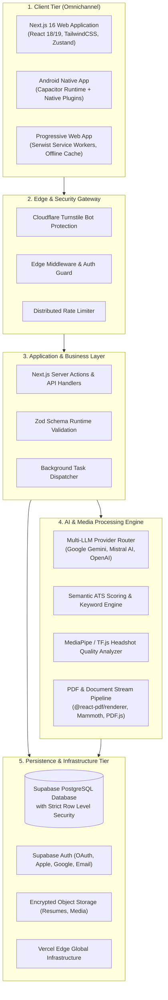

# 🚀 ResumeAI — System Architecture & Technical Case Study

<p align="center">
  
  
  
  
</p>

---

> [!IMPORTANT]
> ### 🔒 Proprietary Software & Intellectual Property Notice
> The complete source code, proprietary algorithms, database schemas, prompt engineering pipelines, and commercial infrastructure of **ResumeAI** are strictly proprietary trade secrets. This repository serves as a **Technical Whitepaper & Engineering Case Study** detailing the high-level system architecture, engineering challenges, technical decisions, and production benchmarks.

---

## 📌 Executive Summary

**ResumeAI** is an enterprise-grade, AI-driven career acceleration platform designed to eliminate the friction in modern job search. The system combines multi-model LLM orchestration, deterministic ATS (Applicant Tracking System) parsing, real-time multilingual localization (10+ languages), and cross-platform native delivery (Web + Android).

### 🎯 Key Highlights
- 🧠 **Multi-Model LLM Orchestration:** Fault-tolerant routing across leading LLM providers with automatic fallback strategies.
- 📊 **Real-Time ATS Score Engine:** Sub-second heuristic and semantic evaluation of resumes against targeted job descriptions.
- 🌍 **Deep Multilingual Localization:** Seamless synchronization across 10+ languages with build-time i18n validation checks.
- 📱 **Omnichannel Delivery:** Single unified TypeScript codebase serving responsive desktop, mobile web, and native Android (via Capacitor).
- 🛡️ **Zero-Trust Data Protection:** Multi-tenant PostgreSQL database strictly isolated via Supabase Row-Level Security (RLS) policies.

---

## 🏗️ High-Level System Architecture



---

## ⚡ Core Engineering Deep Dives

### 1. Resilient Multi-Provider LLM Orchestration
Modern production AI applications cannot rely on a single vendor due to rate limits, transient outages, and latency fluctuations.
* **Fallback Cascades:** The system automatically dispatches prompts through primary high-speed models (e.g., Gemini 2.0 / Flash) and falls back to secondary inference providers (e.g., Mistral Large / OpenAI) without user disruption.
* **Structured Output Guarantees:** Enforced JSON Schema constraints at the prompt and runtime layers using `Zod` validation to prevent hallucinated data shapes from corrupting the document tree.

### 2. Client-Side & Server-Side Dual PDF Generation Pipeline
Generating pixel-perfect, ATS-compliant PDF documents across multiple locales requires dual-mode rendering:
* **Interactive Live Preview:** Built on dynamic HTML5 Canvas and SVG layers for 60fps real-time visual editing.
* **Vector Document Compilation:** Powered by `@react-pdf/renderer` and `pdfjs-dist` to generate searchable, vector-accurate, print-ready PDF/A compliant documents that parse cleanly in all major corporate ATS engines (Workday, Greenhouse, Lever, Taleo).

### 3. Deep Multilingual Localization (i18n) Architecture
ResumeAI provides full native support across 10+ locales:
* **Build-Time Schema Synchronization:** Custom CI/CD validation scripts (`test:i18n`) verify key parity across all language bundles (`src/i18n/locales/*.json`), halting builds on missing translations.
* **Dynamic Tone & Cultural Adaptation:** AI prompts adapt resume phrasing to cultural norms (e.g., European CV vs. US Resume standards).

### 4. Zero-Trust Security & Data Isolation
* **Row-Level Security (RLS):** Every table in PostgreSQL enforces strict tenant isolation at the database layer. Users can never query or mutate data belonging to other accounts, even if an API endpoint logic were compromised.
* **Client-Side Bot Mitigation:** Cloudflare Turnstile integration ensures automated scrapers and malicious bots cannot consume LLM inference credits.

---

## 🧪 Quality Assurance & CI/CD Pipeline

```
Code Commit 
    └── Push to GitHub
         ├── 1. Static Analysis (ESLint 9 + TypeScript 5.5 Strict Check)
         ├── 2. i18n Parity Audit (check-i18n.js)
         ├── 3. Unit & Integration Testing (Vitest)
         ├── 4. End-to-End Cross-Browser Testing (Playwright Headless Suite)
         ├── 5. Production Build & Bundle Optimization (Next.js)
         └── 6. Edge Deployment (Vercel)
```

- **Playwright E2E:** Simulates full user lifecycles: authentication, resume creation, drag-and-drop section reordering (`@dnd-kit`), AI generation, and PDF download.
- **Continuous Monitoring:** Real-time performance insights and analytics via `@vercel/analytics` and `@vercel/speed-insights`.

---

## 💻 Tech Stack Summary

| Layer | Technologies |
| :--- | :--- |
| **Framework & Core** | Next.js 16 (App Router), React 18.3, TypeScript 5.5 |
| **Styling & Design** | TailwindCSS, Radix UI Primitives, Lucide Icons, Framer Motion |
| **Database & Auth** | Supabase (PostgreSQL, Row Level Security, SSR, Storage, OAuth) |
| **AI Inference** | Google Generative AI (Gemini), Mistral AI SDK, TensorFlow.js |
| **Document Processing** | `@react-pdf/renderer`, `pdfjs-dist`, `mammoth`, `html2canvas` |
| **Mobile Integration** | Capacitor 8 (Android runtime, native plugins) |
| **Testing & CI** | Playwright 1.47, Vitest 2.1, GitHub Actions CI |

---

## 🌐 Live Product & Contact
* **Live Application:** [ResumeAI Platform](https://github.com/Vitalikdeve)
* **Lead Architect:** [Vitalik Zelianko (@Vitalikdeve)](https://github.com/Vitalikdeve)
* **Email Inquiries:** [vitalikzelianko@gmail.com](mailto:vitalikzelianko@gmail.com)

---
*Copyright © Vitalik Zelianko. All rights reserved. ResumeAI is a registered proprietary product.*
