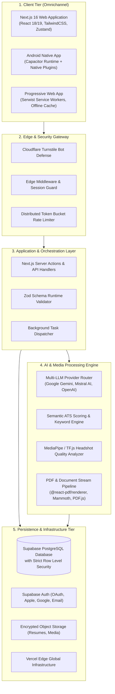

# 🚀 ResumeAI — System Architecture & Production Engineering Case Study

<p align="center">
  
  
  
  
</p>

---

> [!IMPORTANT]
> ### 🔒 Intellectual Property & Proprietary Trade Secret Notice
> All underlying source code, **AI model training pipelines, domain fine-tuning datasets, model weights, loss configurations, prompt engineering orchestration**, proprietary scoring heuristics, database schemas, and commercial infrastructure of **ResumeAI** are strictly confidential, proprietary trade secrets.
>
> To protect commercial competitive advantage and prevent unauthorized replication:
> * **No raw training datasets, data curation scripts, or fine-tuning hyperparameters are published.**
> * **No internal system prompts, model weights, or proprietary scoring algorithms are disclosed.**
> * This repository provides an **In-Depth System Architecture Case Study & Engineering Whitepaper** focused on high-level reliability, distributed topology, security boundaries, and operational resilience.

---

## 📑 Table of Contents
1. [01 — Executive Overview & Problem Domain](#01--executive-overview--problem-domain)
2. [02 — High-Level System Architecture & Topology](#02--high-level-system-architecture--topology)
3. [03 — AI Infrastructure & Multi-Model Orchestration](#03--ai-infrastructure--multi-model-orchestration)
4. [04 — Persistence & Zero-Trust Data Layer](#04--persistence--zero-trust-data-layer)
5. [05 — Security, Authentication & Bot Defense](#05--security-authentication--bot-defense)
6. [06 — Performance & Edge Optimization](#06--performance--edge-optimization)
7. [07 — Omnichannel & Mobile Architecture](#07--omnichannel--mobile-architecture)
8. [08 — Quality Assurance, i18n Auditing & CI/CD](#08--quality-assurance-i18n-auditing--cicd)
9. [09 — Real Engineering Challenges & Trade-offs](#09--real-engineering-challenges--trade-offs)
10. [10 — Architectural Summary & Key Takeaways](#10--architectural-summary--key-takeaways)

---

## 01 — Executive Overview & Problem Domain

### The Problem Space
Modern recruitment workflows rely heavily on automated **Applicant Tracking Systems (ATS)** to filter candidate resumes before human review. Candidates face three core friction points:
1. **ATS Formatting Failures:** Incompatible document layouts, missing industry keywords, or non-standard document structures often cause qualified candidates to be filtered out automatically.
2. **Localization Barriers:** Adapting resumes for international job markets (US one-page standard vs. detailed European CVs) requires culturally relevant phrasing and terminology.
3. **Inference Latency & Provider Reliability:** Single-provider AI integrations frequently suffer from upstream rate limits, sporadic latency spikes, and unpredictable output structures.

### The Engineering Solution
**ResumeAI** was architected as a high-reliability, multi-tenant career platform designed for fast ATS semantic analysis, real-time multilingual resume customization across 10+ locales, and vector PDF document compilation across both Web and native Android environments.

---

## 02 — High-Level System Architecture & Topology



### Architectural Rationale: Edge-Modular Monolith
Rather than introducing the operational complexity of distributed microservices prematurely, ResumeAI was built as an **Edge-Modular Monolith** using Next.js App Router:
- **Direct Edge Access:** Low-latency database interactions via Supabase SSR client with connection pooling.
- **Decoupled Domain Services:** Core business modules (ATS evaluation, document compilation, AI routing) are structured as isolated TypeScript services independent of the UI layer.

---

## 03 — AI Infrastructure & Multi-Model Orchestration

```
User Request ──► Circuit Breaker ──► Primary: Google Gemini 2.0 Flash
                                           │ (On Rate Limit / Timeout)
                                           ▼
                                     Fallback: Mistral Large / OpenAI
                                           │ (Enforced JSON Schema)
                                           ▼
                                     Zod Validation ──► Client Stream
```

### 1. Multi-Provider Cascade Routing
To maintain operational continuity during third-party AI outages:
- Primary inference dispatches to fast, low-cost models (e.g., Gemini 2.0 Flash).
- Automatic cascade failover routes requests to secondary providers (Mistral Large, OpenAI) upon rate-limit responses or execution timeouts.

### 2. Deterministic Structured Output
All AI generation endpoints enforce runtime JSON schemas validated with `Zod`. If an LLM returns malformed data, an automatic correction routine validates the structure before propagating state to the client.

> *Note: Proprietary domain fine-tuning datasets, training parameters, loss functions, and model weights are retained strictly within private corporate infrastructure.*

---

## 04 — Persistence & Zero-Trust Data Layer

### Strict Row-Level Security (RLS)
The database layer (Supabase / PostgreSQL) enforces strict data isolation:
- Database policies enforce `auth.uid() = user_id` on all customer tables.
- Cross-tenant data access is blocked at the database engine level regardless of API handler logic.

### Reactive State Management
Client-side resume trees are synchronized with `Zustand`, enabling smooth drag-and-drop reordering (`@dnd-kit`) with optimistic state updates.

---

## 05 — Security, Authentication & Bot Defense

- 🛡️ **Cloudflare Turnstile Protection:** AI generation requests require a valid cryptographic Turnstile token verified server-side to protect compute budgets.
- 🔐 **Multi-Provider Auth:** Integrated OAuth (Google, Apple) and email authentication managed through Supabase Auth with secure HTTP-only cookies.
- 🚫 **Isolated Secrets:** API credentials, payment webhooks, and service role keys are strictly scoped to server execution environments.

---

## 06 — Performance & Edge Optimization

- ⚡ **Dynamic Module Splitting:** Heavy document parsers (`pdfjs-dist`, `@react-pdf/renderer`, `mammoth`) are loaded dynamically only when an export action is initiated, keeping the initial bundle size low.
- 💨 **Edge Caching:** Static marketing pages and assets are cached globally on Vercel Edge Network.
- 🔄 **Asynchronous Background Jobs:** Automated content generation and syndication scripts run out-of-band without impacting user-facing request latency.

---

## 07 — Omnichannel & Mobile Architecture

```
Unified TypeScript Core
├── 🌐 Next.js Web Portal (Desktop / Tablet)
├── 📱 Android Native App (Capacitor 8 Bridge)
└── ⚡ PWA (Serwist Offline Service Worker)
```

- **Capacitor 8 Bridge:** Reuses web components while accessing native Android capabilities such as storage, biometric authentication, and system share dialogs.
- **Adaptive Interface:** Responsive layout shifts between a dual-pane editor on desktop and a focused single-column workflow on mobile.

---

## 08 — Quality Assurance, i18n Auditing & CI/CD

```
Code Push ──► Static Lint & Typecheck ──► i18n Key Parity Audit ──► Vitest Unit Tests ──► Playwright E2E ──► Vercel Deploy
```

### 1. Build-Time i18n Parity Audit
A custom verification script (`check-i18n.js`) executes before every build, verifying key and structure parity across all language bundles (`src/i18n/locales/*.json`) to prevent missing translation regressions in production.

### 2. End-to-End Test Automation
Headless **Playwright** test suites simulate complete user journeys: authentication, resume editing, drag-and-drop reordering, AI enhancements, and PDF generation.

---

## 09 — Real Engineering Challenges & Trade-offs

| Engineering Challenge | The Problem | Architectural Decision & Solution | Outcome |
| :--- | :--- | :--- | :--- |
| **Upstream AI Instability** | Intermittent rate limits and latency spikes from individual AI providers. | Multi-provider cascade router with exponential backoff and circuit breakers. | Continuous application availability during single-provider degradation. |
| **ATS Parsing vs. Visual Design** | Complex CSS layouts fail when parsed by legacy ATS scanners (Workday, Taleo). | Dual-mode rendering: HTML5 Canvas for interactive preview + vector `@react-pdf/renderer` for export. | Searchable, well-structured text extraction in corporate ATS parsers. |
| **Multilingual Consistency** | Adding new features frequently caused missing translation keys in non-English locales. | Enforced automated build-time JSON schema parity validation in CI pipeline. | Automated detection of missing keys before deployment. |
| **Client Bundle Overhead** | Document compilation libraries inflated initial page load times on mobile. | Extracted export logic into dynamic import chunks loaded on demand. | Faster initial page rendering and reduced mobile data consumption. |

---

## 10 — Architectural Summary & Key Takeaways

- 🎯 **Reliability First:** Multi-model fallback architecture prevents downtime caused by third-party AI provider outages.
- 🌍 **Localization Ready:** Comprehensive i18n architecture with build-time schema validation across 10+ languages.
- 📱 **Cross-Platform Delivery:** Unified TypeScript codebase powering Web, PWA, and Android.
- 🔒 **Defense in Depth:** Multi-tenant PostgreSQL with Row-Level Security, Turnstile bot defense, and server-side secret isolation.

---

## 🌐 Live Product & Inquiries
* **Live Product:** [ResumeAI Platform](https://github.com/Vitalikdeve)
* **Lead Developer:** [Vitalik Zelianko (@Vitalikdeve)](https://github.com/Vitalikdeve)
* **Contact Email:** [VitaliZelianko@vitocv.com](mailto:VitaliZelianko@vitocv.com)

---
*Copyright © Vitalik Zelianko. All rights reserved. ResumeAI is a registered proprietary software product.*
